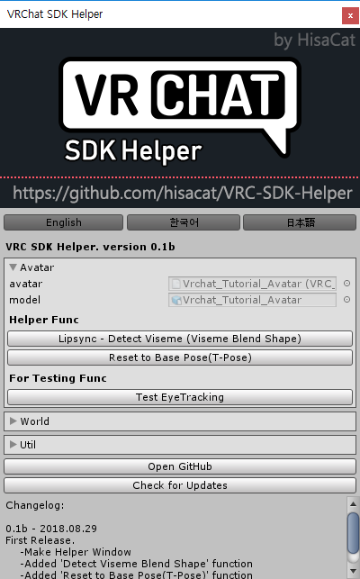
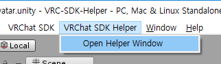

VRC-SDK-Helper
============
Unityよりも便利にVRC SDKを使うことができる機能を追加しました。 
*Read this in other languages: [English](README.md), [한국어](README.ko.md), [日本語](README.ja.md).*

このプロジェクトが役立つたら、Donate  をお願いします!

## 使い方
まず、unitypackageをインストールします。 
上に "VRC SDK Helper"メニューが表示されます。 
"Open Helper Window"ボタンを選択してください！ 

## 기능

## Todo
* MDを書く
* 最初のリリース
* アップデート機能
* SnailMarker自動セットアップ

## 기부
飢えています...ｗ 
読んでいただきありがとうございます！ 
