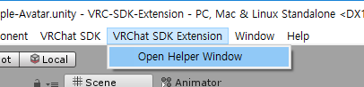

# VRC-SDK-Helper

Unity에서 보다 편리하게 VRC SDK를 사용할 수 있는 기능들을 추가했습니다. 
*Read this in other languages: [English](README.md), [한국어](README.ko.md), [日本語](README.ja.md).*

이 프로젝트가 도움이 되었다면, 기부  를 부탁드려요!

## 사용법
먼저, unitypackage를 설치합니다. 
상단에 "VRC SDK Helper" 메뉴가 표시됩니다. 
"Open Helper Window"버튼을 선택해주세요! 

## 기능
* 아바타 관련
  * Viseme Blend Shape 자동 할당
  * 기본 포즈로 초기화 (T-Pose)
  * 아이트래킹 테스트
* 월드 관련
* 부가기능

## Todo
* MD 작성
* 첫번째 릴리즈
* 업데이트 체크 기능
* SnailMarker 자동 설치

## 기부
굶고 있습니다… 
읽어주셔서 감사합니다! 
