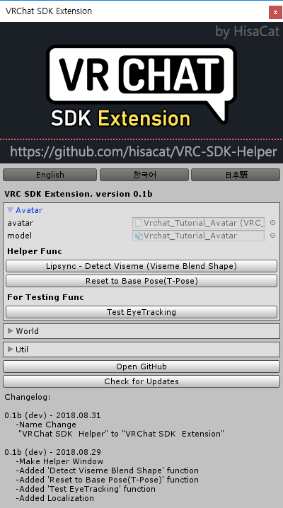
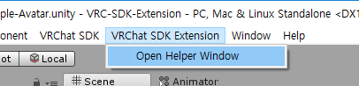

# VRC-SDK-Extension

Added some abilities to use the VRC SDK more conveniently in Unity. 
*Read this in other languages: [English](README.md), [한국어](README.ko.md), [日本語](README.ja.md).*

If this project is helpful to you, Donate  Me!

##  Useage
First, import unitypackage. 
then you can see the "VRC SDK Helper" Menu in top. 
Just select "Open Helper Window"! 

## Functions
* Avatar
  * Detect Viseme (Viseme Blend Shape)
  * Reset to Base Pose (T-Pose)
  * Test Eyetracking
* World
* Util

## Todo
* Write MD
* First release
* Check update func
* Auto setup SnailMarker

## Donate
I'm starving… 
Thanks to read! 
